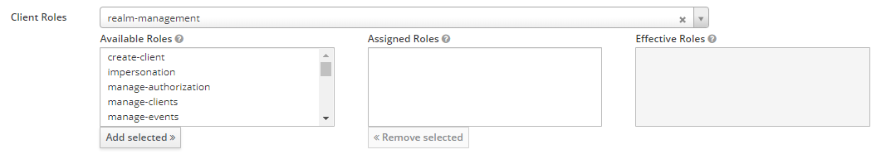
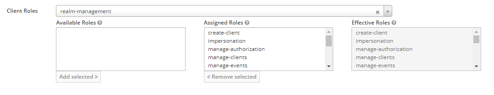

# Configure test realm
- Login to your Keycloak administrative console
- Create a new realm named `Insurance`
- Create a new client within the `Insurance` realm named `insurance-product`
- Create a new user within the `Insurance` realm
- Add all available roles from the `realm-management` client roles to the new user  

# Prepare `appsettings.json`
- Copy `_appsettings.json` to `appsettings.json`
- Set the values for `url`, `userName`, and `password`